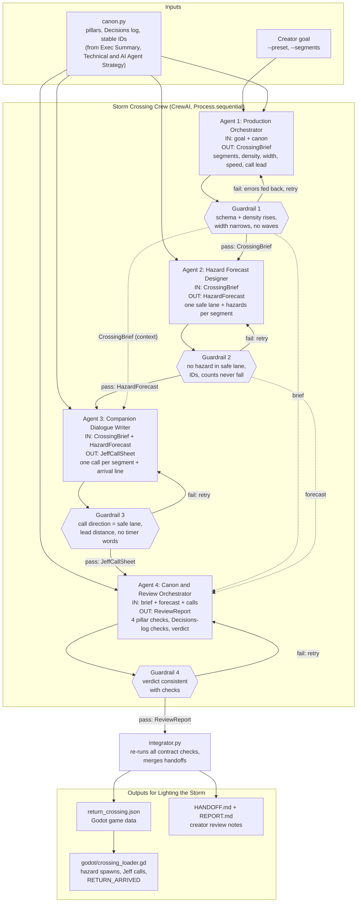

# Storm Crossing Crew — for *Lighting the Storm*

**Game:** *Lighting the Storm* — a first-person, single-player atmospheric folk-horror adventure for PC, built in Godot 4 with GDScript.

**What this crew produces:** the game data for the **return crossing** of the Gate 1 vertical slice — the timed boat run from the abandoned outpost back to the Bracken Isle lighthouse with the replacement beacon burner aboard. One run of the crew outputs `return_crossing.json`, which the game loads directly, plus the `HANDOFF.md` and `REPORT.md` notes the creator uses to review the work before merging it.

## Why the game needs this

In *Lighting the Storm*, the apprentice steers a powered boat with one control at one fixed speed while Jeff, an old seaman, shouts directions over the storm. The return crossing is where the hidden ship deadline is running, so it is the part of the game where the design rules matter most. The design documents set several hard rules for it:

- Hazard density, route width and visibility must rise with route position, never with elapsed time (the "storm split").
- There is one shared hazard forecast with a single safe-route signal per segment, and Jeff's calls must never disagree with it.
- Only rocks, reefs, buoys and debris are allowed. Waves are an unapproved stretch goal, and route branching is deferred.
- There is no visible timer. Every collision is recoverable to a safe point.

Getting the hazard layout, the safe route and Jeff's lines to agree by hand is fiddly and easy to break whenever one piece is tuned. This crew generates all three together from one brief, checks them against each other and against the design pillars, and hands the creator a package that is consistent by construction. Regenerating it for a different difficulty preset (`standard` or `assist`) or route length is one command.

## The agents

The four agents mirror the roles in the game's *AI Agent Strategy* document. They run in sequence, and each one's output is validated before the next can start.

| # | Agent | Input | Output | Why the pipeline breaks without it |
|---|---|---|---|---|
| 1 | **Production Orchestrator** | Creator goal, preset, segment count, canon | `CrossingBrief`: segment IDs, length, hazard density, route width, minimum visibility, boat speed, Jeff's call lead distance, constraints | Nobody defines the segments, tuning or difficulty curve. Agent 2 has nothing to place hazards into. |
| 2 | **Hazard Forecast Designer** | `CrossingBrief` | `HazardForecast`: one safe lane per segment, hazards (type, lane, distance, readability cue), recovery safe points | There is no safe-route signal, so Jeff has nothing to call and the game has nothing to spawn. |
| 3 | **Companion Dialogue Writer** | `CrossingBrief` + `HazardForecast` | `JeffCallSheet`: one shouted call per segment that matches its safe lane, subtitles, the arrival line ("go, go, go — don't wait for me") | The player gets no guidance. Pillar 3 says guidance comes from Jeff, not from markers. |
| 4 | **Canon and Review Orchestrator** | All three handoffs | `ReviewReport`: four pillar checks, Decisions-log checks, PASS/REVISE verdict, open creator decisions, handoff summary | The integrator refuses to write game data without a review, and `HANDOFF.md` has no verdict or evidence. |

**How the agents coordinate.** Every task has a CrewAI guardrail (`validators.py`). When an agent's output breaks the contract, for example when Jeff says "right" where the forecast's safe lane is "left", the specific error is sent back to that agent and it retries, up to three times. Validated outputs are stored in a shared state and passed on as context to later agents. After the crew finishes, `integrator.py` runs every check again end to end before it writes any game data.

## Architecture

The same diagram is in `crew_architecture.mermaid`.



## Running it

```bash
pip install -r requirements.txt

# 1. Smoke test, no API key needed: the full CrewAI pipeline runs with a scripted LLM
python main.py --offline

# 2. Real run: copy .env.example to .env and add your ANTHROPIC_API_KEY
python main.py
python main.py --preset assist --segments 4 --out output_assist
```

| Flag | Default | Meaning |
|---|---|---|
| `--offline` | off | Use `offline_llm.py` (deterministic, no key) instead of a real model |
| `--preset` | `standard` | `standard` or `assist` (the reduced hazard-intensity preset) |
| `--segments` | `5` | Route segments, 3–8 |
| `--goal` | Gate 1 return-crossing goal | The creator's goal text given to the Production Orchestrator |
| `--out` | `output` | Output folder |
| `--quiet` | off | Hide CrewAI's verbose agent logs |

You can switch models with `CREW_MODEL` in `.env`. Any CrewAI/LiteLLM model string works, for example `openai/gpt-4o-mini` with `OPENAI_API_KEY` set.

**Offline mode** exists so the crew can be run and marked without an API key. It still runs the real CrewAI agents, tasks, context passing and guardrails. Only the model's text is scripted. On purpose, the Dialogue Writer gets one call wrong on its first attempt. The console then shows `Guardrail blocked (attempt 1/4) ... JEFF_RET_02 says 'right' but the forecast safe lane for SEG_02 is 'left'`, followed by the corrected retry, so you can see the agents coordinating. The creative content in a real run comes from the LLM.

## Output

```
output/
├── return_crossing.json      # loaded by the game
├── HANDOFF.md                # 8 fixed headings from the AI Agent Strategy
├── REPORT.md                 # orchestrator report, fixed headings
└── handoffs/                 # each agent's validated output, for traceability
    ├── 01_brief.json
    ├── 02_forecast.json
    ├── 03_calls.json
    └── 04_review.json
```

`return_crossing.json` holds the tuning values (fixed boat speed, call lead, route length, `waves_enabled: false`) and the stable event IDs (`RETURN_DEPARTED`, `SEGMENT_ENTERED`, `HAZARD_COLLISION`, `RECOVERY`, `RETURN_ARRIVED`). For each segment it gives the safe lane, the recovery point, the hazards with their absolute route positions, and Jeff's call with its trigger position. `sample_output/` contains a complete offline run.

**Using it in Godot 4:** copy the JSON to `res://data/` and attach `godot/crossing_loader.gd` to the sea scene. Each physics frame, call `advance(route_m)`. The loader emits `jeff_call`, `segment_entered` and `return_arrived` signals and provides `hazards()` for the spawner. `reset_for_restart()` supports the Gate 1 "fail, then restart the slice" model.

## Files

| File | Purpose |
|---|---|
| `main.py` | CLI entry point: picks the LLM, runs the crew, writes outputs |
| `crew.py` | The four agents, their tasks, context links and guardrails |
| `schemas.py` | Pydantic contracts for every handoff |
| `validators.py` | Deterministic cross-checks (the game's rules as code) |
| `canon.py` | Canon taken from the three design documents |
| `integrator.py` | Final checks; writes game data, HANDOFF.md and REPORT.md |
| `offline_llm.py` | Scripted LLM for runs without a key |
| `godot/crossing_loader.gd` | Reads the output in the game |
| `crew_architecture.mermaid` | Architecture diagram |

## Scope and limits

The crew follows the game's own rules for agents: it only proposes, and the creator reviews and merges. It does not decide the open canon questions (exact collision time cost, deadline length, pause exploits, the final retry and save model). Those are carried into `HANDOFF.md`. Steering feel, hazard readability in engine and Jeff's voice performance still need human playtesting.
